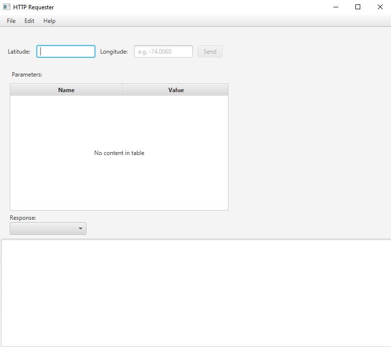
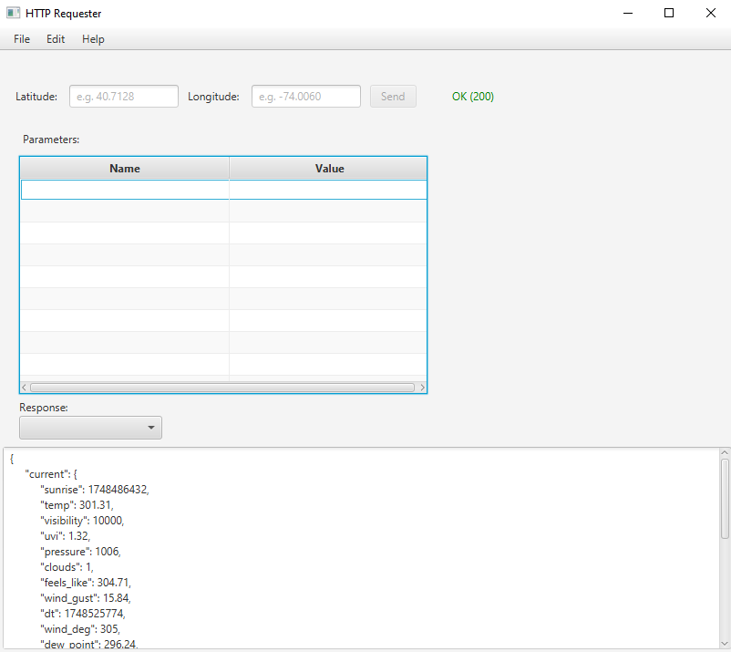
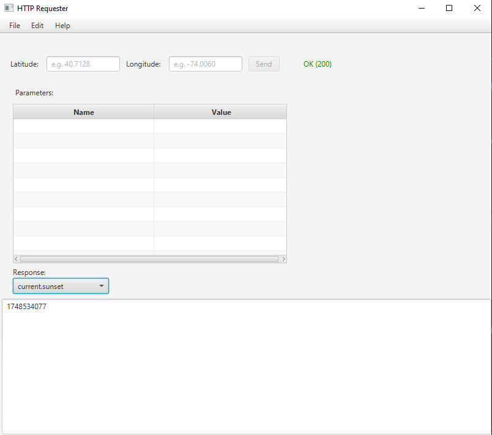

# Weather API Sorter 🌤️

## 📝 Project Description

This application fetches and displays weather data based on latitude and longitude coordinates, with JSON data sorting capabilities.

## 🚀 Getting Started

### Prerequisites

- Java Runtime Environment (JRE)
- OpenWeatherMap API Key
- VS Code with Java Extension Pack
  Required JAR Files:
  - [JavaFX SDK 20.0.1](https://gluonhq.com/products/javafx/) - GUI Framework
  - [java-dotenv 5.2.2](https://github.com/cdimascio/dotenv-java/releases) - Environment Variables
  - [java-json](https://mvnrepository.com/artifact/org.json/json) - JSON Processing
  - [kotlin-stdlib 2.2.0](https://mvnrepository.com/artifact/org.jetbrains.kotlin/kotlin-stdlib) - Required for java-dotenv

### ⚙️ Setup Steps

1. **Clone and Configure:**

   ```bash
   git clone [repo-url]
   ```

   Create `.env` file in root directory:

   ```
   API_KEY=YOUR_ACTUAL_API_KEY_HERE
   ```

2. **Download and Setup JAR Files:**
   a) Create a `lib` folder in your project root if it doesn't exist
   b) Download the required JAR files from the links above
   c) Copy all downloaded JAR files to the `lib` folder

3. **VS Code JAR Configuration:**
   There are two ways to add the JARs to your project:

   a) **Automatic Method:**

   - After copying JARs to the `lib` folder
   - VS Code will automatically detect and update `settings.json`

   b) **Manual Method:**

   - Open "JAVA PROJECTS" panel in VS Code
   - Right-click "Referenced Libraries"
   - Select "Add Jar" to include required files

   > Note: The `settings.json` file is automatically created in `.vscode` folder.

4. **Run the Application:**
   - Execute `start.java` in `app/src`
   - Enter coordinates and click "Send"
   - Use the selection box to filter/sort JSON data

## 🌐 API Information

Base URL: `https://api.openweathermap.org/data/3.0/onecall`
Parameters are automatically appended.

## ⚠️ Common Issues

- **Missing JARs:** Ensure all required JARs are in `lib` folder and properly referenced
- **API Key Issues:** Verify `.env` file location and API key validity
- **Invalid Request:** Check coordinate format and values

## 📁 Project Structure

- `src/`: Source code
- `lib/`: Dependencies
- `bin/`: Compiled output
- `.vscode/`: IDE configuration (gitignored)

## 📸 Screenshots






